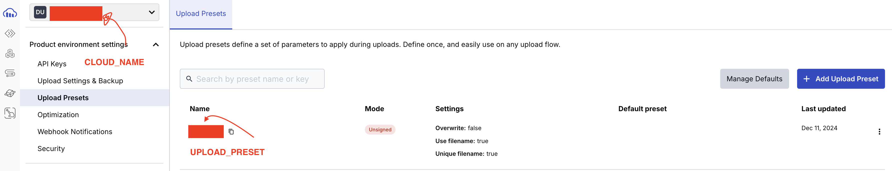
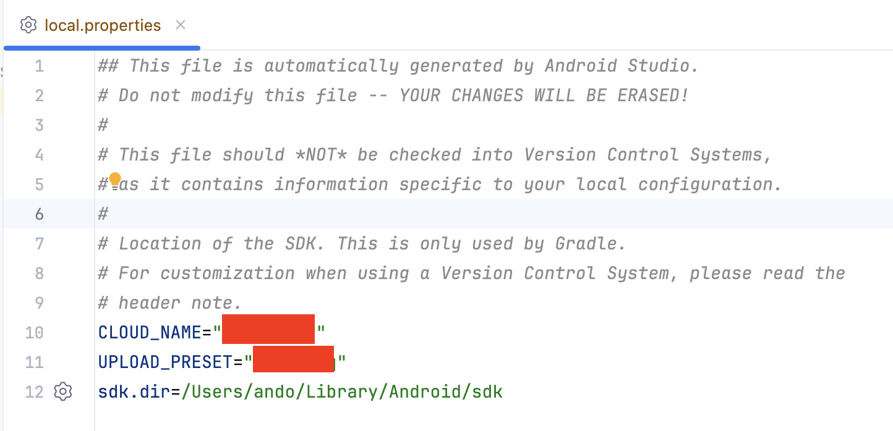

# development env

Android Studio Ladybug

# Android Pixel 9 Pro Fold API Baklava

[capture.webm](https://github.com/user-attachments/assets/34b27d8f-c97a-4a66-bbf7-876ef152d6c0)

# Cloudinaryアプリを動かすための準備

## CLOUD_NAMEとUPLOAD_PRESETはCloudinaryのダッシュボードから取得する

## `local.properties`にCLOUD_NAMEとUPLOAD_PRESETを追加する

# refs
https://cloudinary.com/documentation/android_integration 